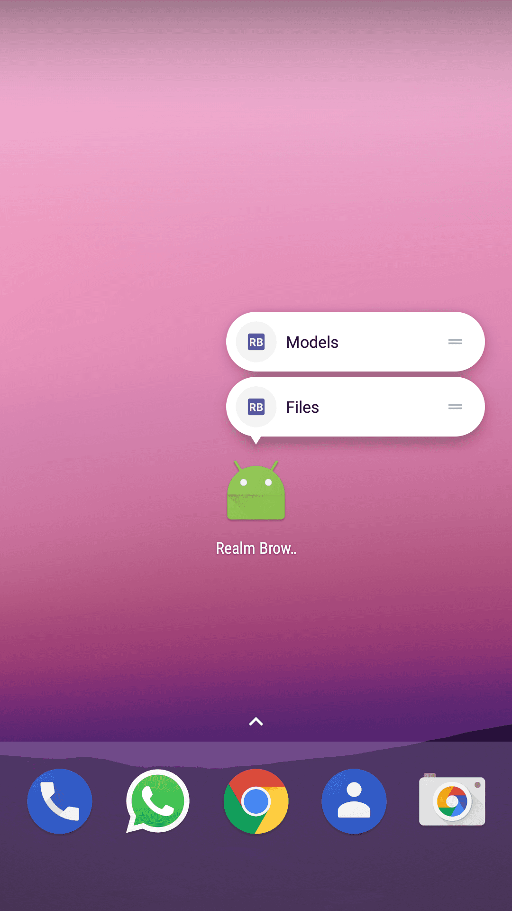
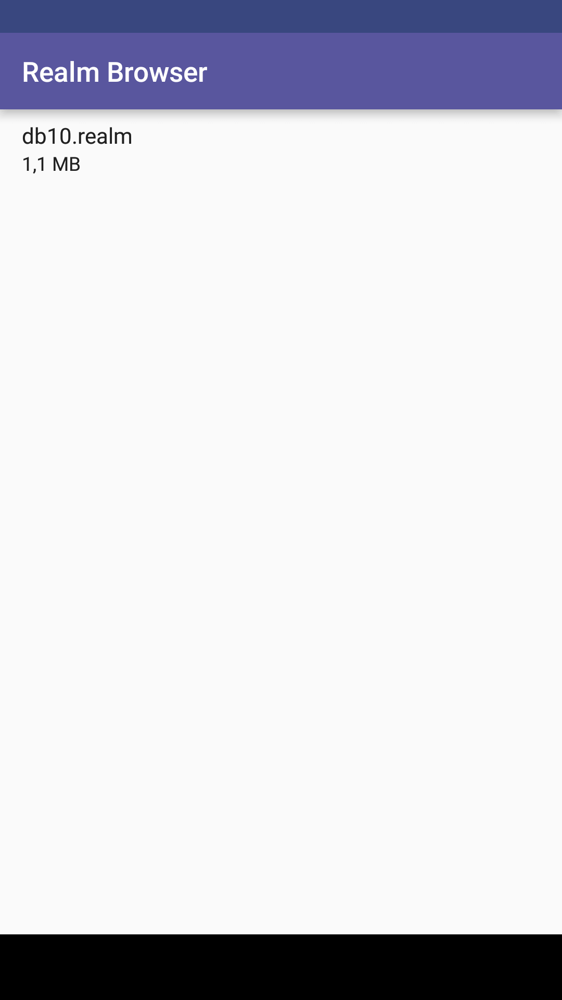
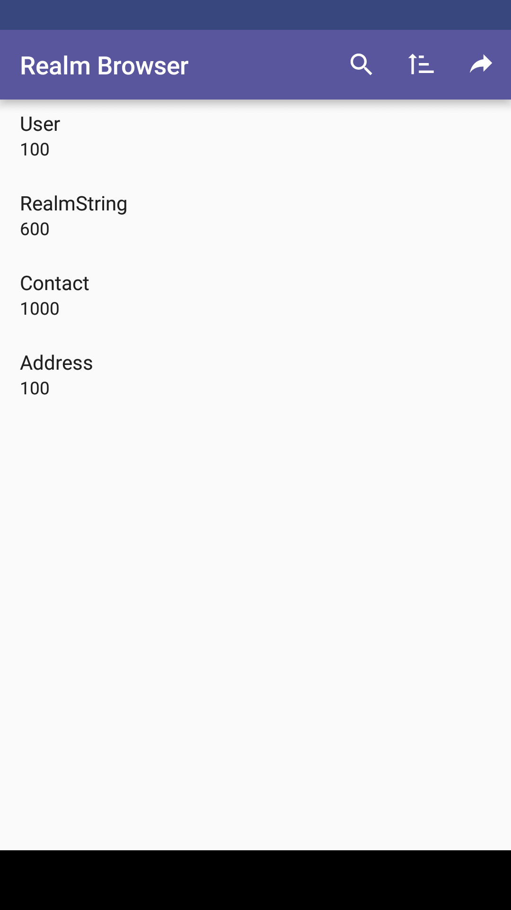
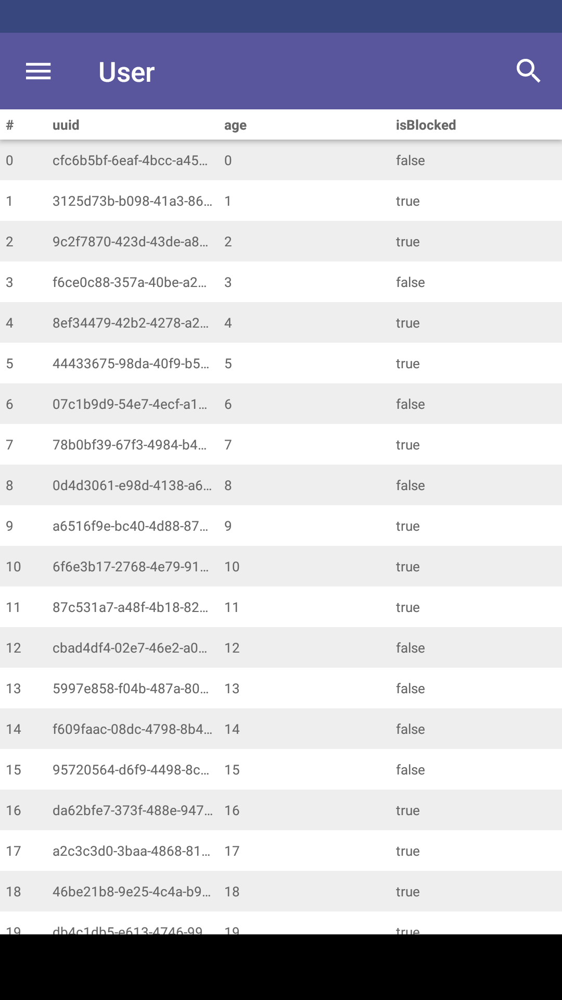
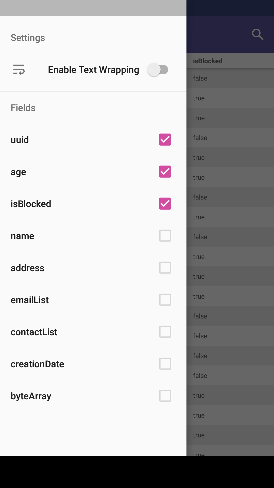
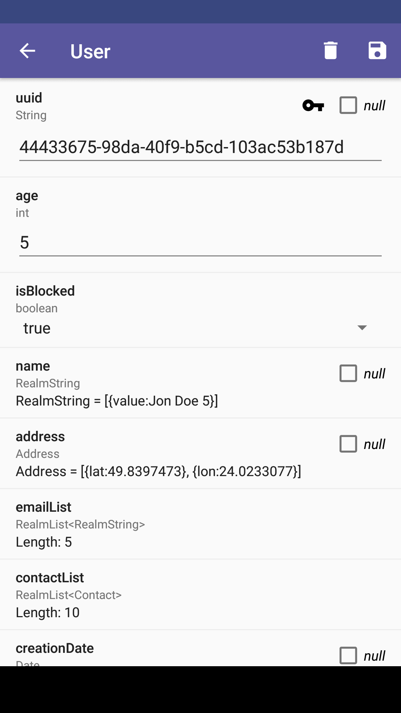

### Description

This library project provides a convenient way for Android developers to see the contents of their [Realm](https://github.com/realm/realm-java) database files on the device.

It's a fork of [dmytrodanylyk/realm-browser](https://github.com/dmytrodanylyk/realm-browser) which was originally created by Danylyk Dmytro but sadly discontinued.

 |  | 
--- | --- | ---
 |  | 

### Integration [](https://jitpack.io/#jonasrottmann/realm-browser) [](https://codecov.io/gh/jonasrottmann/realm-browser)
Releases: [](https://travis-ci.org/jonasrottmann/realm-browser) - Develop branch (Snapshots): [](https://travis-ci.org/jonasrottmann/realm-browser)

The project is available via [JitPack.io](https://jitpack.io/#jonasrottmann/realm-browser/).

1. **Add the JitPack repository to your build file**
  ```
  allprojects {
          repositories {
          ...
          maven { url "https://jitpack.io" }
          }
      }
  }
  ```

2. **Add the dependency**
  ```
  dependencies {
      debugCompile 'com.github.jonasrottmann.realm-browser:realm-browser:v0.0.9'
      testCompile 'com.github.jonasrottmann.realm-browser:realm-browser-no-op:v0.0.9'
      releaseCompile 'com.github.jonasrottmann.realm-browser:realm-browser-no-op:v0.0.9'
  }
  ```
  The no-op version of Realm Browser has empty functions which do nothing. It is not necessary to include this, but you may if you do not want to access Realm Browser in release mode. If you want to use a build of the newest development use `compile "com.github.jonasrottmann.realm-browser:realm-browser:develop-SNAPSHOT"` instead.

3. Exclude support libraries (maybe optional): Realm Browser depends on Android support libraries, so you might want to exclude them from your project if they conflict with the ones you include:
  ```
  depedencies {
      debugCompile ('com.github.jonasrottmann.realm-browser:realm-browser:v0.0.9') {
          exclude group: 'com.android.support';
      }
  }
  ```

4. Add ProGuard rules (optional): Use these if you enable minification for debug builds or want to use Realm Browser in release builds.
  ```
  # Realm Browser
  -keep class de.jonasrottmann.realmbrowser.* { *; }
  -keep class android.support.v7.widget.SearchView { *; }
  -keep class android.support.v7.view.** { *; }
  ```

### Usage

If you want to see all your database files:

```
RealmBrowser.startRealmFilesActivity(context);
```

If you want to see all the tables in a database call:

```
RealmBrowser.startRealmModelsActivity(context, realmConfiguration);
```

To display a notification from which the Realm Browser can be started:

```
RealmBrowser.showRealmFilesNotification(context);
```
```
RealmBrowser.showRealmModelsNotification(context, realmConfiguration);
```

There are also [App Shortcuts](https://developer.android.com/guide/topics/ui/shortcuts.html) available for devices running Android 7.1 or newer:

```
RealmBrowser.addFilesShortcut(context);
```
```
RealmBrowser.addModelsShortcut(context, realmConfiguration)
```

For a full working example check out the [sample app](https://github.com/jonasrottmann/realm-browser/blob/release/app/src/main/java/de/jonasrottmann/realmsample/MainActivity.java).

### TODO
What's on the roadmap... 🚀
- [ ] Tests
- [ ] Be able to edit/create objects
- [ ] Bidirectional scrolling in the browser window
- [ ] Clean up
- [ ] Nice architecture
- [ ] Live reload the browser if updates happen in the background
- [ ] Javadoc 📚

### Other browsers

If you're looking for a Realm browser for your iOS Swift projects check out [bearjaw/RBSRealmBrowser](https://github.com/bearjaw/RBSRealmBrowser) 🎉

### License

```
The MIT License (MIT)

Original Work: Copyright (c) 2015 Danylyk Dmytro

Modified Work: Copyright (c) 2015 Rottmann, Jonas

Permission is hereby granted, free of charge, to any person obtaining a copy
of this software and associated documentation files (the "Software"), to deal
in the Software without restriction, including without limitation the rights
to use, copy, modify, merge, publish, distribute, sublicense, and/or sell
copies of the Software, and to permit persons to whom the Software is
furnished to do so, subject to the following conditions:

The above copyright notice and this permission notice shall be included in all
copies or substantial portions of the Software.

THE SOFTWARE IS PROVIDED "AS IS", WITHOUT WARRANTY OF ANY KIND, EXPRESS OR
IMPLIED, INCLUDING BUT NOT LIMITED TO THE WARRANTIES OF MERCHANTABILITY,
FITNESS FOR A PARTICULAR PURPOSE AND NONINFRINGEMENT. IN NO EVENT SHALL THE
AUTHORS OR COPYRIGHT HOLDERS BE LIABLE FOR ANY CLAIM, DAMAGES OR OTHER
LIABILITY, WHETHER IN AN ACTION OF CONTRACT, TORT OR OTHERWISE, ARISING FROM,
OUT OF OR IN CONNECTION WITH THE SOFTWARE OR THE USE OR OTHER DEALINGS IN THE
SOFTWARE.
```
