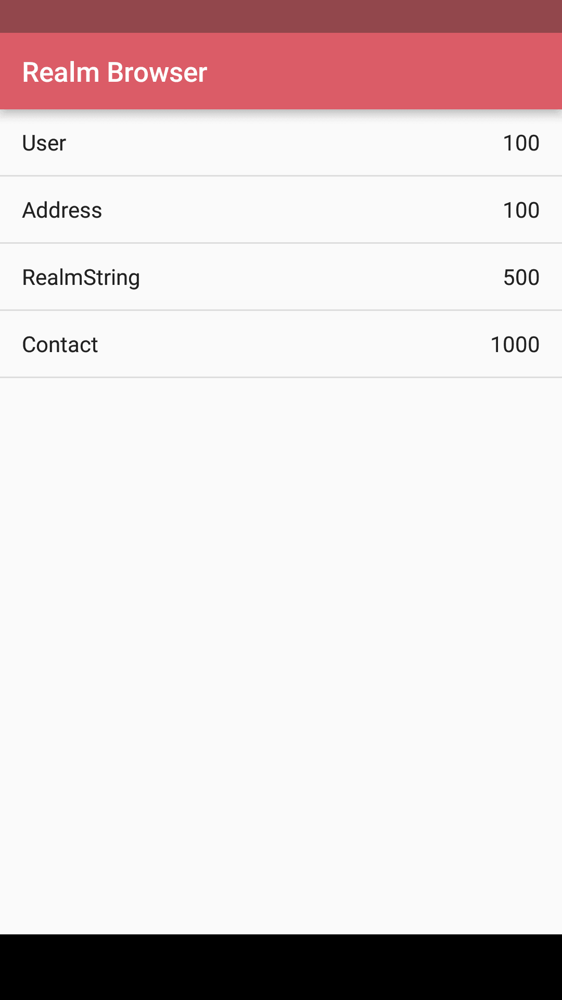
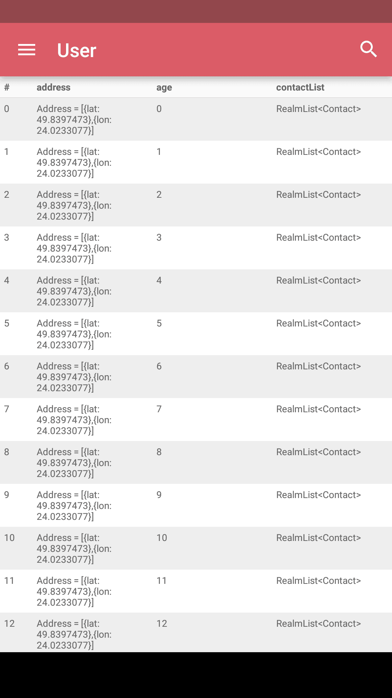
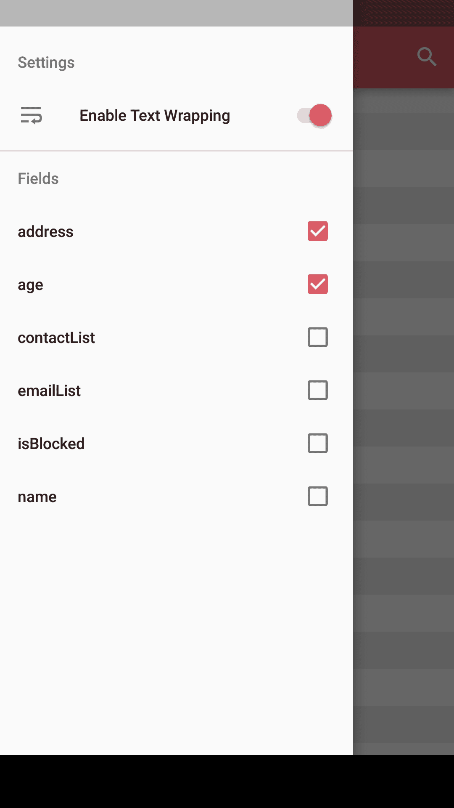

### Description

Android [Realm](https://github.com/realm/realm-java) Browser

This is a fork of [dmytrodanylyk/realm-browser](https://github.com/dmytrodanylyk/realm-browser) which was originally created by Danylyk Dmytro.

 |  | 
--- | --- | ---


### Integration [ ](https://bintray.com/jonasrottmann/maven/realm-browser/_latestVersion)

The project is available on JCenter.

```
dependencies {
    compile 'de.jonasrottmann:realm-browser:0.0.6@aar'
}
```

### Usage

To initialize the Realm Browser add all classes which you want to see using the method below. Those classes must extend `RealmObject`.

```
RealmBrowser.getInstance().addRealmModel(Example.class, ...);
```

If you want to see all your databases call:

```
RealmBrowser.startRealmFilesActivity(context);
```

If you want to see all your table list call:

```
RealmBrowser.startRealmModelsActivity(context, "<name of the database file>")
```

To display a notification from which the Realm Browser can be started.

```
RealmBrowser.showRealmFilesNotification(context);
```

For a full working example check out the [sample app](https://github.com/jonasrottmann/realm-browser/blob/release/app/src/main/java/de/jonasrottmann/realmsample/MainActivity.java).

### License

```
The MIT License (MIT)

Original Work: Copyright (c) 2015 Danylyk Dmytro

Modified Work: Copyright (c) 2015 Rottmann, Jonas

Permission is hereby granted, free of charge, to any person obtaining a copy
of this software and associated documentation files (the "Software"), to deal
in the Software without restriction, including without limitation the rights
to use, copy, modify, merge, publish, distribute, sublicense, and/or sell
copies of the Software, and to permit persons to whom the Software is
furnished to do so, subject to the following conditions:

The above copyright notice and this permission notice shall be included in all
copies or substantial portions of the Software.

THE SOFTWARE IS PROVIDED "AS IS", WITHOUT WARRANTY OF ANY KIND, EXPRESS OR
IMPLIED, INCLUDING BUT NOT LIMITED TO THE WARRANTIES OF MERCHANTABILITY,
FITNESS FOR A PARTICULAR PURPOSE AND NONINFRINGEMENT. IN NO EVENT SHALL THE
AUTHORS OR COPYRIGHT HOLDERS BE LIABLE FOR ANY CLAIM, DAMAGES OR OTHER
LIABILITY, WHETHER IN AN ACTION OF CONTRACT, TORT OR OTHERWISE, ARISING FROM,
OUT OF OR IN CONNECTION WITH THE SOFTWARE OR THE USE OR OTHER DEALINGS IN THE
SOFTWARE.
```
